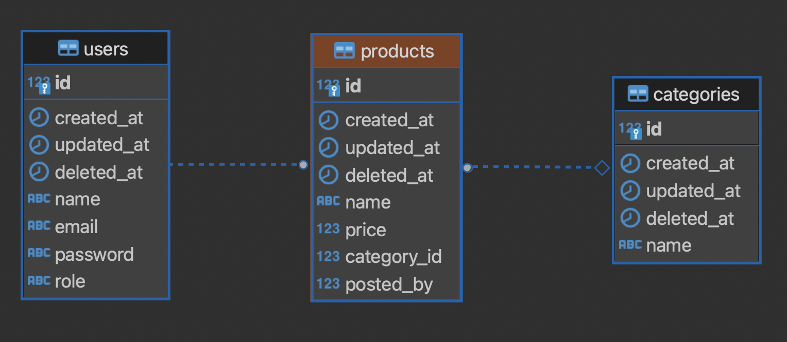

# Product API
### ERD


### Instructions
- Please fork this repository to your private github repo.
- Create branch with name `<your_sikm_id>_<name>`.
- Push your changes to your branch.
- For any "challenge/homework", mentee can submit PR to branch `master` of this repo (upstream). Any MR submitted before deadline will get an extra score on "nilai keaktifan" for subject "Web Application".

### Session 1
Objectives during session:
- [ ] Intro [Gin framework](https://github.com/gin-gonic/gin/blob/master/docs/doc.md)
- [ ] Gin router and middleware
- [ ] Gin [model binding and validation](https://gin-gonic.com/docs/examples/binding-and-validation/)
- [ ] Clean architecture
- [ ] Concept of [DTO](https://en.wikipedia.org/wiki/Data_transfer_object)
- [ ] SQL error handling with [pgconn.PgError](https://github.com/jackc/pgx/blob/master/pgconn/errors.go)

#### Feat 1: Get list products
- Should return status code `200` when success select data from DB.
- Response should contain list product with their category.

API Contract: `GET /product/list`, sample response:
```
[
    {
        "id": 1,
        "name": "Beng-beng",
        "price": 2500,
        "category_id": 1,
        "posted_by": 1,
        "category": {
            "id": 1,
            "name": "Snack"
        }
    },
    {
        "id": 2,
        "name": "Top",
        "price": 1500,
        "category_id": 1,
        "posted_by": 1,
        "category": {
            "id": 1,
            "name": "Snack"
        }
    }
]
```

#### Feat 2: Get product detail
- Should return status code `200` when product with given id found in database.
- Product detail should get product data with it's category and the user/creator of the product.
- Should return status code `404` when product with given id not found in database.

API Contract: `GET /product/:id`, sample response:
```
{
    "id": 1,
    "name": "Beng-beng",
    "price": 2500,
    "poster": {
        "id": 1,
        "name": "John Doe",
        "role": "ADMIN",
        "email": "john.doe@mail.com"
    },
    "category": {
        "id": 1,
        "name": "Snack"
    }
}
```

#### Feat 3: Post product
- Should return status code `201 (Created)` when insert data success.
- Request payload should be validated with [gin validator](https://gin-gonic.com/docs/examples/binding-and-validation/), the requirement is on  payload sample below. When the validation error should return status code `400`.
- Product's name should not contains words like "termurah", "terbaik", "diskon", and "promo". 
- When `category_id` or `posted_by` id is not exist in DB (ForeignKeyViolation sql error state `23503`), it should return error status code 400. For others postgres error code can be read [here](https://www.postgresql.org/docs/current/errcodes-appendix.html).

API Contract: `POST /product/add`, sample response:
```
{
    "message": "product added"
}
```

Sample request payload and the validation:
```
{
    "name": "Ayam Geprek", // required, min length 8 chars
    "price": 7000, // required, price more than 0
    "category_id": 1, // required
    "posted_by": 1 // required
}
```

#### [CHALLENGE] Feat 4: Update product by ID
- Should be able to update data in product include these fields: name, price, and category_id. Please create new `DTO` for the request payload.
- Product's name should not contains words like "termurah", "terbaik", "diskon", and "promo". 
- Should return status code `200` when update success.
- When product with the given `id` not found in DB, API should return response status code `404`.
- When `category_id` is not exist in DB (ForeignKeyViolation sql error state `23503`), it should return error status code 400. For others postgres error code can be read [here](https://www.postgresql.org/docs/current/errcodes-appendix.html).

API Contract: `PUT /product/update/:id`, sample response:
```
{
    "message": "product updated"
}
```

Sample request payload and the validation:
```
{
    "name": "Ayam Geprek", // required, min length 8 chars
    "price": 7000, // required, price more than 0
    "category_id": 1 // required
}
```

#### [CHALLENGE] Feat 3: Delete product by ID
- Should return status code `200` when delete success.
- When product with the given `id` not found in DB, API should return response status code `404`.

API Contract: `DELETE /product/delete/:id`, sample response:
```
{
    "message": "product deleted"
}
```

### Session 2: JWT Authentication
TBA

### Session 3: Deployment 
TBA
